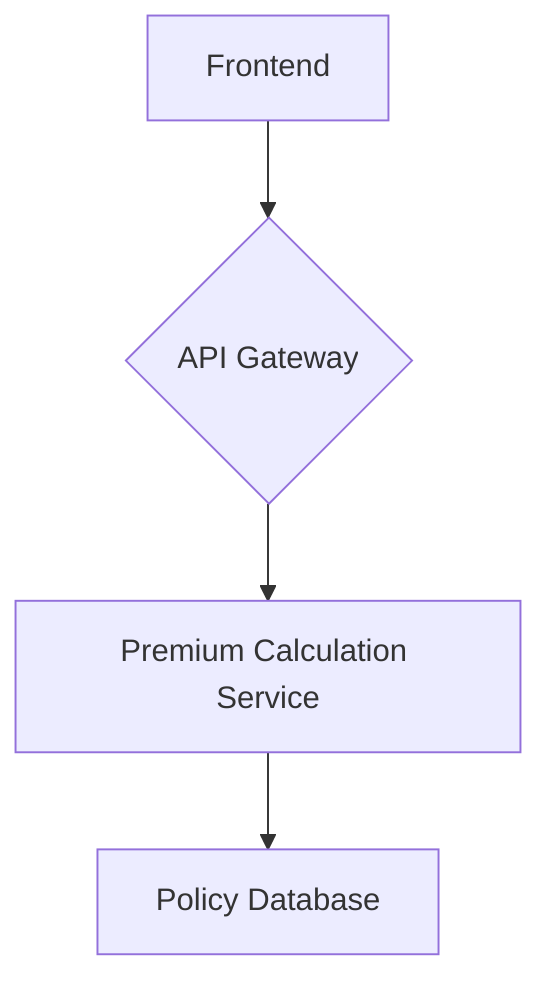

# Vehicle Insurance Premium Calculator

This project is a vehicle insurance premium calculator that allows users to calculate their vehicle insurance premium based on various factors.

## Application Architecture

- **Tech Stack**: FastAPI, React, PostgreSQL
- **High-level component diagram**:



- **Frontend and Backend Communication**: The frontend communicates with the backend via a RESTful API. The API is served at `/api/v1/insurance`.
- **Database Schema**: The database schema consists of a single table `policies` with the following columns:
    - `policyId` (String, Primary Key)
    - `baseRate` (Float)
    - `ncbTier` (String)
    - `ncbDiscount` (Float)
    - `vehicleMultiplier` (Float)
    - `finalPremium` (Float)
    - `vehicleDetails` (JSON)
    - `customerDetails` (JSON)
    - `createdAt` (DateTime)
    - `updatedAt` (DateTime)

## Project Structure

```
.
├── backend
│   ├── app.py
│   ├── core
│   │   ├── __init__.py
│   │   └── database.py
│   ├── models
│   │   ├── __init__.py
│   │   └── policy.py
│   ├── routers
│   │   ├── __init__.py
│   │   └── insurance.py
│   ├── schemas
│   │   ├── __init__.py
│   │   └── policy.py
│   ├── services
│   │   ├── __init__.py
│   │   └── premium_calculator_service.py
│   └── tests
│       ├── __init__.py
│       ├── test_insurance_api.py
│       └── test_premium_calculator_service.py
└── frontend
    ├── index.html
    ├── package.json
    ├── postcss.config.js
    ├── src
    │   ├── App.jsx
    │   ├── components
    │   │   ├── EstimatedPremiumDisplay.jsx
    │   │   ├── Footer.jsx
    │   │   ├── Header.jsx
    │   │   ├── MainContent.jsx
    │   │   ├── SideNavBar.jsx
    │   │   └── VehicleDetailsForm.jsx
    │   ├── index.css
    │   └── main.jsx
    ├── tailwind.config.js
    └── vite.config.js
```

## Prerequisites

- Python 3.10+
- Node.js 18+
- npm
- git

## Setup Instructions

### Backend

1.  Create a virtual environment: `python -m venv venv`
2.  Activate the virtual environment: `source venv/bin/activate`
3.  Install the dependencies: `pip install -r backend/requirements.txt`
4.  Run the application: `uvicorn backend.app:app --reload`

### Frontend

1.  Install the dependencies: `npm install`
2.  Run the application: `npm run dev`

## API Documentation

### Calculate Premium

- **Endpoint**: `POST /api/v1/insurance/premium/calculate`
- **Request Body**:

```json
{
  "baseRate": 500,
  "ncbTier": "Tier 1",
  "vehicleMultiplier": 1.2
}
```

- **Response**:

```json
{
  "premium": 480
}
```

## Running Tests

### Backend

`pytest backend/tests`

### Frontend

`npm test`
